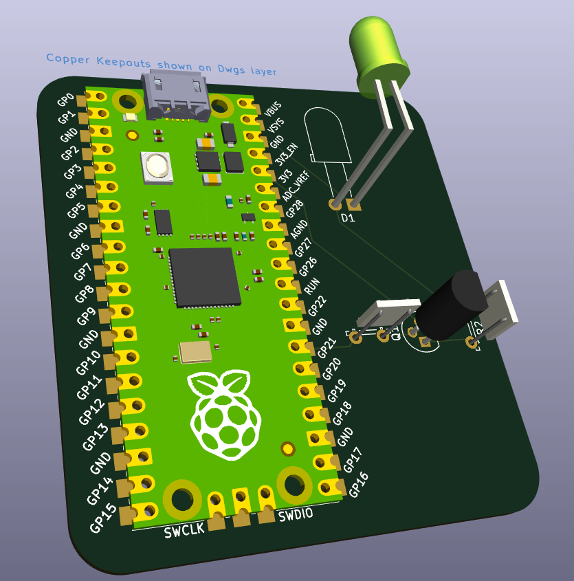

# LED_Transistor_PCB

Esse repositório armazena um projeto simples de PCB (Printed Circuit Board, ou Placa de Circuito Impresso em português) de um circuito para acender e apagar um LED a partir de um transistor e um Raspberry Pi Pico.

Essa PCB foi projetada através do software Kicad, que não tem suporte oficial para o Raspberry Pi Pico. Portanto, para abrir e visualizar os arquivos do projeto adequadamente, você deve seguir as instruções [neste outro respositório](https://github.com/ncarandini/KiCad-RP-Pico).

## Estrutura de pastas

```bash
├── img
├── pcb_interruptor
│   ├── pcb_interruptor.kicad_pcb
│   ├── pcb_interruptor.kicad_pro
│   └── pcb_interruptor.kicad_sch
└── README.md
```

- **img** -> Pasta com imagens ilustrativas relacionadas ao projeto
- **pcb_interruptor.kicad_pcb** -> Arquivo de design finalizado da PCB
- **pcb_interruptor.kicad_pro** -> Arquivo principal do projeto da PCB
- **pcb_interruptor.kicad_sch** -> Arquivo de desenho esquemático da PCB
- **README.md** -> Arquivo com informações detalhadas sobre o projeto

## Componentes utilizados

- 1x Raspberry Pi Pico
- 1x Transistor
- 1x Resistor de 1kΩ
- 1x Resistor de 220Ω
- 1x LED simples

## Funcionamento

Com todos os devidos componentes encaixados e ligados conforme o desenho esquemático e com o Raspberry Pi Pico conectado a uma fonte de alimentação (ex.: USB), o LED deverá acender toda vez que o transistor receber energia do pino 27 (GPIO 21). Esse comportamento pode ser programado através de código no Raspberry PI pico.

## Imagens do projeto

### Desenho esquemático


### Design de PCB


### Visualização 3D


